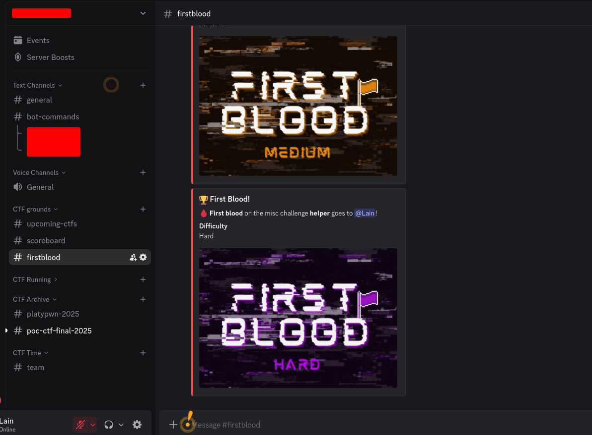
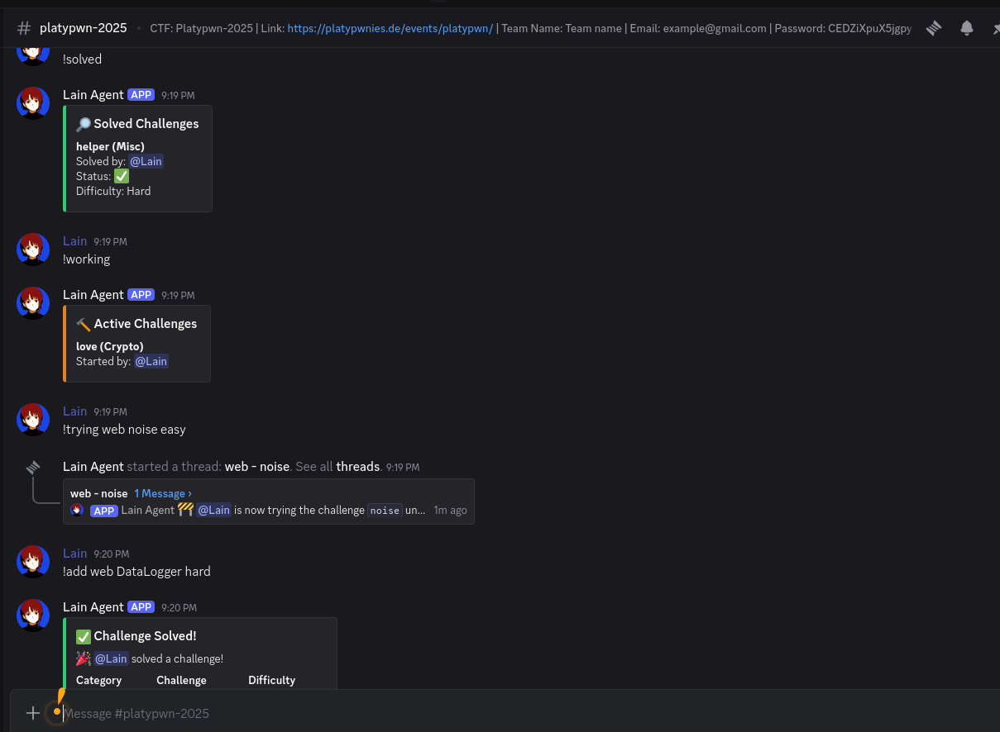
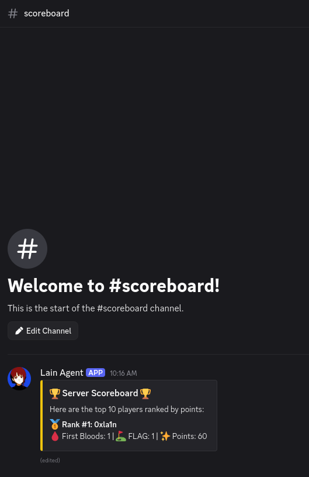
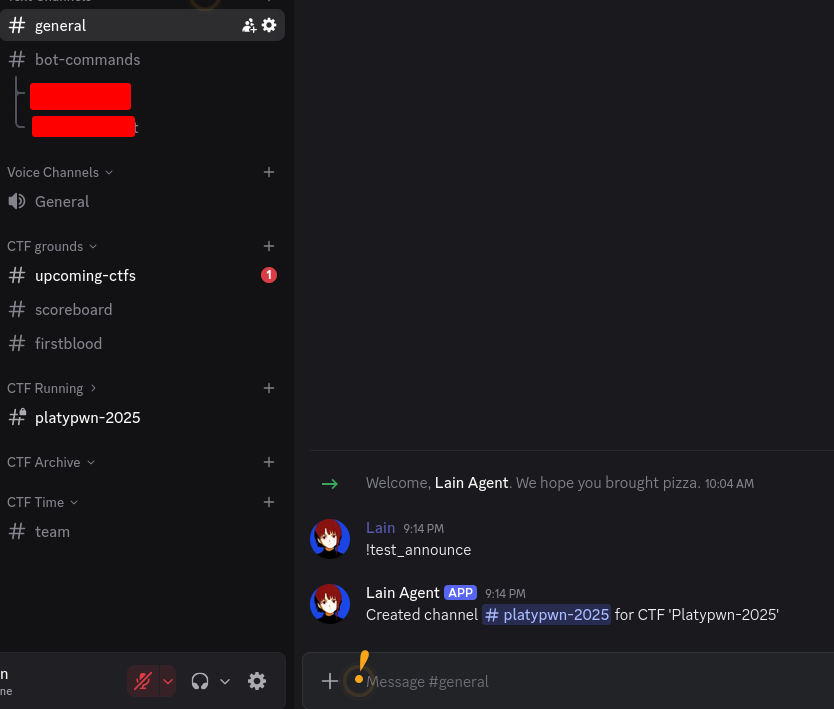
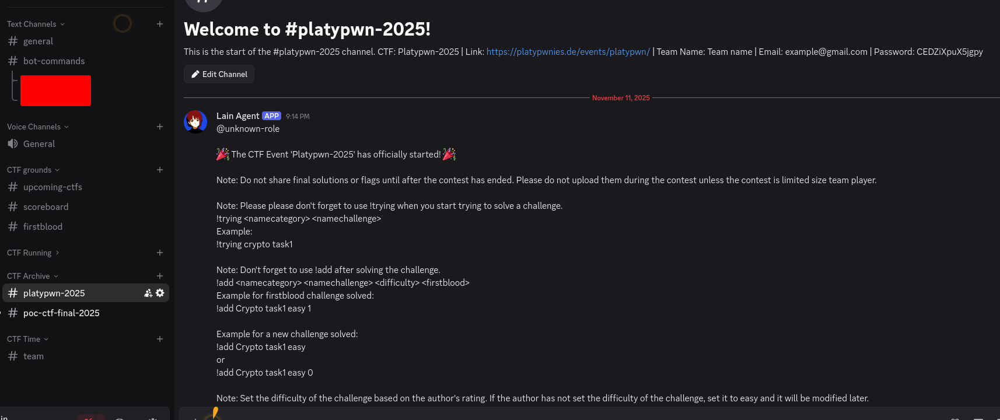

<p align="center">
  
</p>

<p align="center">
  <b>Lain</b> Lain Agent — Level up your CTF team game!
  🧠 Collaboration • 📊 Progress Tracking • 🕵️ Solving challenges
</p>


# Lain CTF Team Manager


## Features

### Team Management
- **Real-time Scoreboard**: Automatically updated leaderboard tracking points, first bloods, and challenge completions
- **Player Profiles**: Detailed statistics for each team member including category breakdowns and rankings
- **First Blood Tracking**: Special recognition for first solves with custom animated GIFs

### Challenge Management
- **Challenge Tracking**: Mark challenges as "working on" with dedicated discussion threads
- **Solve Logging**: Record solved challenges with automatic point calculation
- **Category System**: Support for multiple CTF categories (pwn, reverse, web, crypto, forensics, etc.)
- **Active Challenges**: View who's working on what in real-time

### CTFtime Integration
- **Team Stats**: Automatic updates of your CTFtime team statistics every 24 hours
- **Upcoming CTFs**: Automated announcements for high-value CTF competitions
- **CTF Channels**: Automatic channel creation for announced CTFs with role management
- **CTF Archiving**: Automatic archival of CTF channels after events end

### Points System
- **Difficulty-Based Scoring**:
  - Easy: 100 points
  - Medium: 250 points
  - Hard: 500 points
- **First Blood Bonus**: +50% points for first solves
- **Category Roles**: Automatic role assignment for first solve in each category

---

## Quick Start

Choose your preferred deployment method:

- **[Option 1: Replit / Direct Python](#option-1-replit--direct-python-deployment)** - Easy, no Docker required, free hosting
- **[Option 2: Docker](#option-2-docker-deployment)** - Production-ready, works on any VPS or local machine

---

## Prerequisites

### Discord Bot Setup (Required for Both Options)

1. **Create Discord Bot Application**:
   - Go to [Discord Developer Portal](https://discord.com/developers/applications)
   - Click "New Application" and give it a name
   - Go to the **Bot** tab and click "Add Bot"
   - Copy your bot token (you'll need this later)

2. **Enable Privileged Gateway Intents**:
   - In the Bot tab, scroll to "Privileged Gateway Intents"
   - Enable these three intents:
     - ✅ **Presence Intent**
     - ✅ **Server Members Intent**
     - ✅ **Message Content Intent**
   - Click "Save Changes"

3. **Invite Bot to Your Server**:
   - Go to OAuth2 > URL Generator
   - Select scopes: `bot`, `applications.commands`
   - Select permissions: `Administrator` (or customize as needed)
   - Copy the generated URL and open it to invite the bot

4. **Get Channel & Category IDs**:
   - In Discord, go to User Settings > Advanced > Enable **Developer Mode**
   - Right-click on channels/categories and select "Copy ID"
   - You'll need IDs for:
     - Scoreboard channel
     - First blood announcements channel
     - CTFtime team stats channel
     - Upcoming CTFs announcements channel
     - Running CTFs category (folder)
     - Archived CTFs category (folder)

---

## Option 1: Replit / Direct Python Deployment

Perfect for quick setup and free hosting on Replit, or running directly on your local machine.

### Step 1: Clone or Download

**On Replit:**
- Fork this Repl or import from GitHub

**On Your Machine:**
```bash
git clone https://github.com/0xla1n/Lain-Agent.git
cd Lain-Agent
```

### Step 2: Install Dependencies

```bash
pip install -r requirements.txt
```

**Required packages:**
- discord.py
- aiosqlite
- requests
- pytz

### Step 3: Configure the Bot

1. **Set your Discord token**:

   **On Replit:**
   - Click the lock icon (Secrets)
   - Add a secret: Key = `TOKEN`, Value = your Discord bot token

   **On your machine:**
   - Create a `.env` file:
     ```bash
     TOKEN=your_discord_bot_token_here
     ```

2. **Update Channel IDs** in `main.py` (lines 99-113):

   ```python
   SCOREBOARD_CHANNEL_ID = 1234567890  # Replace with your channel ID
   FIRSTBLOOD_CHANNEL_ID = 1234567890
   CTFTIME_TEAM_CHANNEL_ID = 1234567890
   UPCOMING_CTFS_CHANNEL_ID = 1234567890
   CTF_RUNNING_CATEGORY_ID = 1234567890
   CTF_ARCHIVE_CATEGORY_ID = 1234567890
   CTFTIME_TEAM_ID = 303159  # Your CTFtime team ID
   ```

3. **Add Required Images** (same directory as `main.py`):
   - `Easy_FirstBlood.gif`
   - `Medium_FirstBlood.gif`
   - `Hard_FirstBlood.gif`
   - `solved.webp`

### Step 4: Run the Bot

**On Replit:**
- Click the "Run" button

**On your machine:**
```bash
python main.py
```

You should see: `Bot ready as YourBotName#1234`

---

## Option 2: Docker Deployment

Recommended for production deployments on VPS, cloud servers, or local Docker environments.

### Step 1: Prerequisites

- Docker installed ([Get Docker](https://docs.docker.com/get-docker/))
- Docker Compose installed (included with Docker Desktop)

### Step 2: Clone the Repository

```bash
git clone https://github.com/0xla1n/Lain-Agent.git
cd Lain-Agent
```

### Step 3: Create Configuration Files

1. **Create `.env` file**:
   ```bash
   cp .env.example .env
   nano .env  # or use your favorite editor
   ```

   Add your Discord token:
   ```env
   TOKEN=your_discord_bot_token_here
   ```

2. **Update Channel IDs** in `main.py` (lines 99-113) as described in Option 1

### Step 4: Build and Run with Docker

**Using Docker Compose (Recommended):**

```bash
# Build and start the bot
docker-compose up -d --build

# View logs
docker-compose logs -f discord-bot

# Stop the bot
docker-compose down
```

**Using Docker directly:**

```bash
# Build the image
docker build -t lain-ctf-manager .

# Run the container
docker run -d \
  --name lain-ctf-bot \
  --restart unless-stopped \
  -e TOKEN=your_token_here \
  -v $(pwd)/data:/app/data \
  lain-ctf-manager

# View logs
docker logs -f lain-ctf-bot

# Stop the container
docker stop lain-ctf-bot
```

### Docker Files Reference

**Dockerfile:**
```dockerfile
FROM python:3.11-slim

WORKDIR /app

COPY requirements.txt .
RUN pip install --no-cache-dir -r requirements.txt

COPY . .

RUN useradd -m -u 1000 botuser && \
    chown -R botuser:botuser /app

USER botuser

CMD ["python", "main.py"]
```

**docker-compose.yml:**
```yaml
version: '3.8'

services:
  discord-bot:
    build: .
    container_name: lain-ctf-bot
    restart: unless-stopped
    env_file:
      - .env
    volumes:
      - ./data:/app/data
    environment:
      - TZ=UTC
```

**.env.example:**
```env
# Discord Bot Token (get from https://discord.com/developers/applications)
TOKEN=your_discord_bot_token_here
```

---

## Configuration

### Required Channel Setup

Create these channels in your Discord server:

| Channel/Category | Purpose |
|-----------------|---------|
| `#scoreboard` | Displays live team scoreboard |
| `#first-bloods` | Announces first blood achievements |
| `#ctftime-stats` | Shows your team's CTFtime statistics |
| `#upcoming-ctfs` | Announces high-value upcoming CTFs |
| `Running CTFs` (category) | Auto-created CTF channels go here |
| `Archived CTFs` (category) | Finished CTF channels move here |

### Required Images

Place these files in the same directory as `main.py`:
- `Easy_FirstBlood.gif` - Shown for easy difficulty first bloods
- `Medium_FirstBlood.gif` - Shown for medium difficulty first bloods
- `Hard_FirstBlood.gif` - Shown for hard difficulty first bloods
- `solved.webp` - Shown for regular challenge solves

### Database

The bot automatically creates a SQLite database (`ctf_team.db`) with these tables:
- `users` - Player statistics and points
- `solved_challenges` - Completed challenges with timestamps
- `active_challenges` - Challenges currently being worked on
- `ctf_participation` - CTF event participation tracking
- `bot_config` - Bot configuration and persistent message IDs

---

## Commands Reference

### Challenge Commands

| Command | Description | Example |
|---------|-------------|---------|
| `!trying <category> <challenge>` | Create discussion thread for a challenge | `!trying web sql-injection-101` |
| `!working` | List all active challenges | `!working` |
| `!add <category> <challenge> <difficulty>` | Mark challenge as solved | `!add crypto rsa-revenge hard` |
| `!unsolve <challenge>` | Remove a solved challenge | `!unsolve sql-injection-101` |

**Supported difficulties:** `easy`, `medium`, `hard`

**Supported categories:** pwn, reverse, dfir, web, crypto, misc, blockchain, osint, android, ppc

### Information Commands

| Command | Description | Example |
|---------|-------------|---------|
| `!solved` | Display all solved challenges | `!solved` |
| `!scoreboard` | Show top 10 players | `!scoreboard` |
| `!categories` | List all solved categories | `!categories` |
| `!profile [member]` | Show detailed player stats | `!profile @username` |

### Admin Commands

| Command | Description | Example |
|---------|-------------|---------|
| `!reset_scoreboard` | Reset entire database (requires admin) | `!reset_scoreboard` |
| `!test_announce` | Manually trigger CTF announcements (requires admin) | `!test_announce` |

---

## Automated Features

### Automatic Scoreboard Updates
The scoreboard is automatically updated whenever:
- A challenge is solved
- A challenge is marked as being worked on
- The database is reset

### CTFtime Integration (24-hour cycle)
- Updates your team's CTFtime statistics daily
- Announces top-weighted upcoming CTFs on Tuesday and Wednesday
- Creates dedicated channels for announced CTFs
- Automatically creates and assigns CTF-specific roles
- Archives CTF channels 3 days after events end

---

## Points System

| Difficulty | Base Points | First Blood Bonus | Total (First Blood) |
|-----------|-------------|-------------------|---------------------|
| Easy      | 100         | +50 (50%)         | 150                 |
| Medium    | 250         | +125 (50%)        | 375                 |
| Hard      | 500         | +250 (50%)        | 750                 |

### First Blood Recognition
- First person to solve a challenge gets +50% bonus points
- Announcement with custom GIF based on difficulty
- Posted in both the current channel and first-bloods channel

### Category Roles
When a player solves their first challenge in a category, they automatically receive a role with that category name (e.g., "Web", "Crypto", "Pwn") with a random color.

---

## Troubleshooting

### Bot not responding
1. Check bot is online in your server (green dot)
2. Verify privileged intents are enabled in Discord Developer Portal
3. Check console/Docker logs for errors
4. Ensure bot has proper permissions in your server

### Commands not working
1. Ensure command prefix is `!`
2. Check exact command syntax
3. Verify you have admin permissions for admin commands
4. Try `!help` to see available commands

### Database issues
1. Use `!reset_scoreboard` (admin only) to reset
2. Check file permissions for `ctf_team.db`
3. Restart the bot

### Docker-specific issues
```bash
# View logs
docker-compose logs -f

# Restart container
docker-compose restart

# Rebuild after changes
docker-compose up -d --build

# Check container status
docker-compose ps
```

---

## Customization

### Modify Point Values
Edit the points dictionary in the `add` command (around line 606):
```python
points_map = {"easy": 100, "medium": 250, "hard": 500}
```

### Change First Blood Bonus
Modify the multiplier in the `add` command (around line 634):
```python
points = int(points * 1.5)  # Change 1.5 to your desired multiplier
```

### Add New Categories
Update the categories list in the `profile` command (around line 806):
```python
categories = ['pwn', 'reverse', 'dfir', 'web', 'crypto', 'misc', 'blockchain', 'osint', 'android', 'ppc']
```

### Change Command Prefix
Update line 20 in `main.py`:
```python
client = commands.Bot(command_prefix="!", intents=intents)
```

---

## Deployment Options Comparison

| Feature | Replit / Direct Python | Docker |
|---------|----------------------|--------|
| Setup Difficulty | Easy | Moderate |
| Free Hosting | Yes (Replit) | No (requires VPS) |
| Auto-restart | Yes (Replit) | Yes (with restart policy) |
| Portability | Medium | High |
| Production Ready | Yes | Yes |
| Resource Control | Limited | Full control |
| Best For | Quick testing, small teams | Production, scaling, multiple bots |

---

## Contributing

Contributions are welcome! Feel free to:
- Report bugs
- Suggest new features
- Submit pull requests
- Share your improvements

---

## License

This project is open source and available for CTF teams to use and modify.

---

## Credits

Created for CTF team coordination and management. Built with discord.py and love for the CTF community.

---

## Support

Having issues? 
1. Check the [Troubleshooting](#troubleshooting) section
2. Review your configuration
3. Check Discord bot permissions
4. Open an issue on GitHub

---

## Quick Links

- [Discord Developer Portal](https://discord.com/developers/applications)
- [discord.py Documentation](https://discordpy.readthedocs.io/)
- [CTFtime](https://ctftime.org/)
- [Docker Documentation](https://docs.docker.com/)

---

## 📸 Gallery

### First Blood Announcements 🩸


### Challenge Management in Action 🎯


### Live Scoreboard 🏆


### Server Organization 📁


### Auto-Created CTF Channels 🚀


### CTFtime Team Integration 🌐


---

**Happy Hacking!** 🚀
